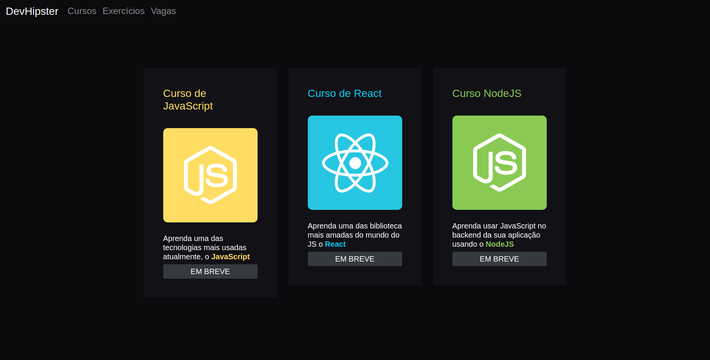

<h1 align="center">
DEVHIPSTER

 
<h1>

## Sobre

Com o intuito de ajudar a comunidade, criei esse projeto. 

Devido a falta de um projeto em português e gratuito criei o Devhipster com o intuito de ajudar a comunidade, uma plataforma gratuita e open sorce de programação.</br>
Os vídeos vão ser postados no meu canal do [youtube](https://www.youtube.com/channel/UCdkEqWvQ05cNpI0wlRMyNWw)</br>
As atualizações vão ser postadas no meu [instagram](https://www.instagram.com/felipepassosdev/?hl=pt-br). 

---

## Tecnologias utilizadas

- [ReactJs](https://pt-br.reactjs.org/)
- [NodeJs](https://nodejs.org/en/)

---

## Como executar o projeto

Para executar o projeto é necessário ter instalado o [NodeJs](https://nodejs.org/en/) e recomendamos a utilização do [Yarn](https://classic.yarnpkg.com/pt-BR/docs/install/)

Clonar o repositório
```bash
$ git clone git@github.com:felipepassosdev/devhipster.git
```
Acessar o diretório clonado
```bash
$ cd devhipster
```
Instalar as dependencias
```bash
$ yarn

ou

$ npm install
```
Executar o projeto
```bash
$ yarn start

ou

$ npm run start
```
